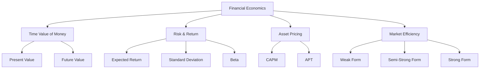

```mermaid
flowchart TD
    A[Financial Economics] --> B[Time Value of Money]
    B --> C[Present Value]
    B --> D[Future Value]

    A --> E[Risk & Return]
    E --> F[Expected Return]
    E --> G[Standard Deviation]
    E --> H[Beta]

    A --> I[Asset Pricing]
    I --> J[CAPM]
    I --> K[APT]

    A --> L[Market Efficiency]
    L --> M[Weak Form]
    L --> N[Semi-Strong Form]
    L --> O[Strong Form]
```
