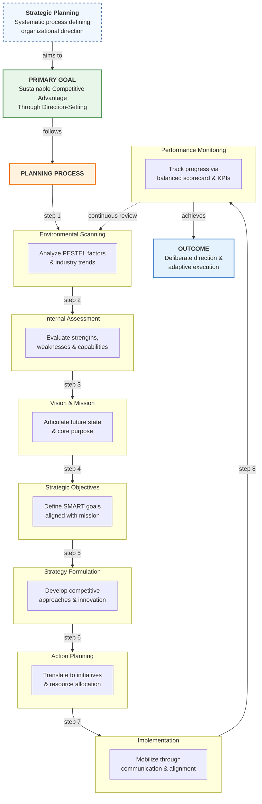

```mermaid
flowchart TD
    A[<b>Strategic Planning</b><br>Systematic process defining<br>organizational direction]:::title
    B[<b>PRIMARY GOAL</b><br>Sustainable Competitive Advantage<br>Through Direction-Setting]:::goal
    C[<b>PLANNING PROCESS</b>]:::process
    
    subgraph D[Environmental Scanning]
        D1[Analyze PESTEL factors<br>& industry trends]
    end
    
    subgraph E[Internal Assessment]
        E1[Evaluate strengths,<br>weaknesses & capabilities]
    end
    
    subgraph F[Vision & Mission]
        F1[Articulate future state<br>& core purpose]
    end
    
    subgraph G[Strategic Objectives]
        G1[Define SMART goals<br>aligned with mission]
    end
    
    subgraph H[Strategy Formulation]
        H1[Develop competitive<br>approaches & innovation]
    end
    
    subgraph I[Action Planning]
        I1[Translate to initiatives<br>& resource allocation]
    end
    
    subgraph J[Implementation]
        J1[Mobilize through<br>communication & alignment]
    end
    
    subgraph K[Performance Monitoring]
        K1[Track progress via<br>balanced scorecard & KPIs]
    end
    
    L[<b>OUTCOME</b><br>Deliberate direction &<br>adaptive execution]:::outcome
    
    A -->|aims to| B
    B -->|follows| C
    C -->|step 1| D
    D -->|step 2| E
    E -->|step 3| F
    F -->|step 4| G
    G -->|step 5| H
    H -->|step 6| I
    I -->|step 7| J
    J -->|step 8| K
    K -->|achieves| L
    K -.->|continuous review| D
    
    classDef title fill:#f0f7ff,stroke:#4a6fa5,stroke-width:2px,color:#333,stroke-dasharray:5 5
    classDef goal fill:#e8f5e9,stroke:#2e7d32,stroke-width:2px,color:#333
    classDef process fill:#fff3e0,stroke:#ef6c00,stroke-width:2px,color:#333
    classDef outcome fill:#e3f2fd,stroke:#1565c0,stroke-width:2px,color:#333
```
