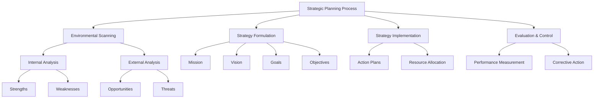

```mermaid
flowchart TD
    A[Strategic Planning Process] --> B[Environmental Scanning]
    B --> C[Internal Analysis]
    C --> D[Strengths]
    C --> E[Weaknesses]
    B --> F[External Analysis]
    F --> G[Opportunities]
    F --> H[Threats]

    A --> I[Strategy Formulation]
    I --> J[Mission]
    I --> K[Vision]
    I --> L[Goals]
    I --> M[Objectives]

    A --> N[Strategy Implementation]
    N --> O[Action Plans]
    N --> P[Resource Allocation]

    A --> Q[Evaluation & Control]
    Q --> R[Performance Measurement]
    Q --> S[Corrective Action]
```
