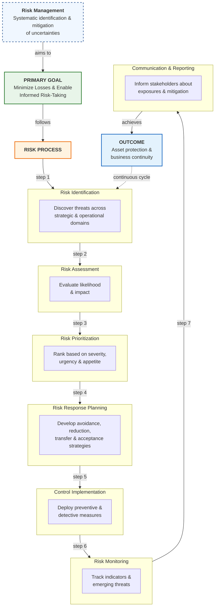

```mermaid
flowchart TD
    A[<b>Risk Management</b><br>Systematic identification & mitigation<br>of uncertainties]:::title
    B[<b>PRIMARY GOAL</b><br>Minimize Losses & Enable<br>Informed Risk-Taking]:::goal
    C[<b>RISK PROCESS</b>]:::process
    
    subgraph D[Risk Identification]
        D1[Discover threats across<br>strategic & operational domains]
    end
    
    subgraph E[Risk Assessment]
        E1[Evaluate likelihood<br>& impact]
    end
    
    subgraph F[Risk Prioritization]
        F1[Rank based on severity,<br>urgency & appetite]
    end
    
    subgraph G[Risk Response Planning]
        G1[Develop avoidance, reduction,<br>transfer & acceptance strategies]
    end
    
    subgraph H[Control Implementation]
        H1[Deploy preventive &<br>detective measures]
    end
    
    subgraph I[Risk Monitoring]
        I1[Track indicators &<br>emerging threats]
    end
    
    subgraph J[Communication & Reporting]
        J1[Inform stakeholders about<br>exposures & mitigation]
    end
    
    K[<b>OUTCOME</b><br>Asset protection &<br>business continuity]:::outcome
    
    A -->|aims to| B
    B -->|follows| C
    C -->|step 1| D
    D -->|step 2| E
    E -->|step 3| F
    F -->|step 4| G
    G -->|step 5| H
    H -->|step 6| I
    I -->|step 7| J
    J -->|achieves| K
    K -.->|continuous cycle| D
    
    classDef title fill:#f0f7ff,stroke:#4a6fa5,stroke-width:2px,color:#333,stroke-dasharray:5 5
    classDef goal fill:#e8f5e9,stroke:#2e7d32,stroke-width:2px,color:#333
    classDef process fill:#fff3e0,stroke:#ef6c00,stroke-width:2px,color:#333
    classDef outcome fill:#e3f2fd,stroke:#1565c0,stroke-width:2px,color:#333
```
