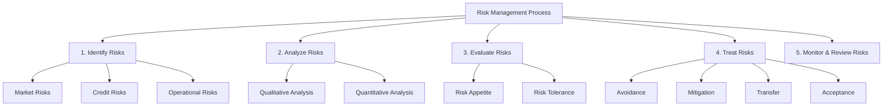

```mermaid
flowchart TD
    A[Risk Management Process] --> B[1. Identify Risks]
    B --> C[Market Risks]
    B --> D[Credit Risks]
    B --> E[Operational Risks]

    A --> F[2. Analyze Risks]
    F --> G[Qualitative Analysis]
    F --> H[Quantitative Analysis]

    A --> I[3. Evaluate Risks]
    I --> J[Risk Appetite]
    I --> K[Risk Tolerance]

    A --> L[4. Treat Risks]
    L --> M[Avoidance]
    L --> N[Mitigation]
    L --> O[Transfer]
    L --> P[Acceptance]

    A --> Q[5. Monitor & Review Risks]
```
