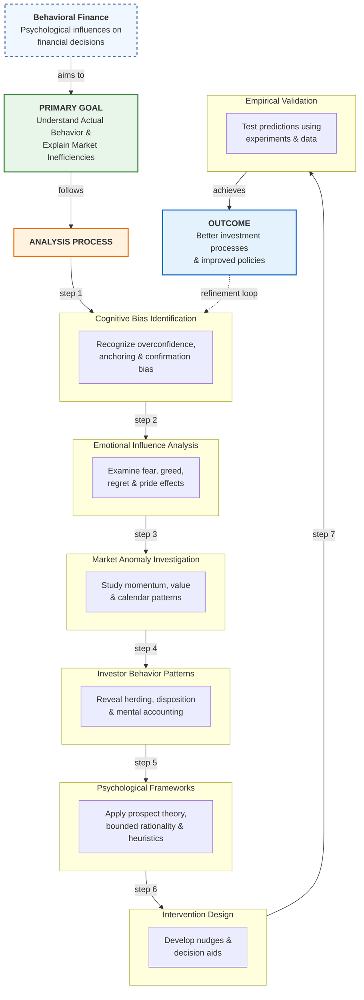

```mermaid
flowchart TD
    A[<b>Behavioral Finance</b><br>Psychological influences on<br>financial decisions]:::title
    B[<b>PRIMARY GOAL</b><br>Understand Actual Behavior &<br>Explain Market Inefficiencies]:::goal
    C[<b>ANALYSIS PROCESS</b>]:::process
    
    subgraph D[Cognitive Bias Identification]
        D1[Recognize overconfidence,<br>anchoring & confirmation bias]
    end
    
    subgraph E[Emotional Influence Analysis]
        E1[Examine fear, greed,<br>regret & pride effects]
    end
    
    subgraph F[Market Anomaly Investigation]
        F1[Study momentum, value<br>& calendar patterns]
    end
    
    subgraph G[Investor Behavior Patterns]
        G1[Reveal herding, disposition<br>& mental accounting]
    end
    
    subgraph H[Psychological Frameworks]
        H1[Apply prospect theory,<br>bounded rationality & heuristics]
    end
    
    subgraph I[Intervention Design]
        I1[Develop nudges &<br>decision aids]
    end
    
    subgraph J[Empirical Validation]
        J1[Test predictions using<br>experiments & data]
    end
    
    K[<b>OUTCOME</b><br>Better investment processes<br>& improved policies]:::outcome
    
    A -->|aims to| B
    B -->|follows| C
    C -->|step 1| D
    D -->|step 2| E
    E -->|step 3| F
    F -->|step 4| G
    G -->|step 5| H
    H -->|step 6| I
    I -->|step 7| J
    J -->|achieves| K
    K -.->|refinement loop| D
    
    classDef title fill:#f0f7ff,stroke:#4a6fa5,stroke-width:2px,color:#333,stroke-dasharray:5 5
    classDef goal fill:#e8f5e9,stroke:#2e7d32,stroke-width:2px,color:#333
    classDef process fill:#fff3e0,stroke:#ef6c00,stroke-width:2px,color:#333
    classDef outcome fill:#e3f2fd,stroke:#1565c0,stroke-width:2px,color:#333
```
