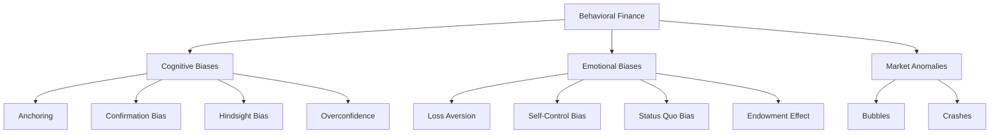

```mermaid
flowchart TD
    A[Behavioral Finance] --> B[Cognitive Biases]
    B --> C[Anchoring]
    B --> D[Confirmation Bias]
    B --> E[Hindsight Bias]
    B --> F[Overconfidence]

    A --> G[Emotional Biases]
    G --> H[Loss Aversion]
    G --> I[Self-Control Bias]
    G --> J[Status Quo Bias]
    G --> K[Endowment Effect]

    A --> L[Market Anomalies]
    L --> M[Bubbles]
    L --> N[Crashes]
```
