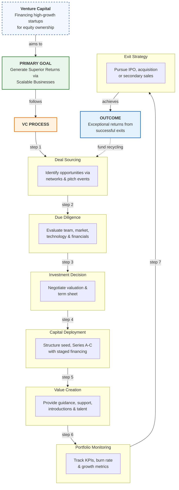

```mermaid
flowchart TD
    A[<b>Venture Capital</b><br>Financing high-growth startups<br>for equity ownership]:::title
    B[<b>PRIMARY GOAL</b><br>Generate Superior Returns via<br>Scalable Businesses]:::goal
    C[<b>VC PROCESS</b>]:::process
    
    subgraph D[Deal Sourcing]
        D1[Identify opportunities via<br>networks & pitch events]
    end
    
    subgraph E[Due Diligence]
        E1[Evaluate team, market,<br>technology & financials]
    end
    
    subgraph F[Investment Decision]
        F1[Negotiate valuation &<br>term sheet]
    end
    
    subgraph G[Capital Deployment]
        G1[Structure seed, Series A-C<br>with staged financing]
    end
    
    subgraph H[Value Creation]
        H1[Provide guidance, support,<br>introductions & talent]
    end
    
    subgraph I[Portfolio Monitoring]
        I1[Track KPIs, burn rate<br>& growth metrics]
    end
    
    subgraph J[Exit Strategy]
        J1[Pursue IPO, acquisition<br>or secondary sales]
    end
    
    K[<b>OUTCOME</b><br>Exceptional returns from<br>successful exits]:::outcome
    
    A -->|aims to| B
    B -->|follows| C
    C -->|step 1| D
    D -->|step 2| E
    E -->|step 3| F
    F -->|step 4| G
    G -->|step 5| H
    H -->|step 6| I
    I -->|step 7| J
    J -->|achieves| K
    K -.->|fund recycling| D
    
    classDef title fill:#f0f7ff,stroke:#4a6fa5,stroke-width:2px,color:#333,stroke-dasharray:5 5
    classDef goal fill:#e8f5e9,stroke:#2e7d32,stroke-width:2px,color:#333
    classDef process fill:#fff3e0,stroke:#ef6c00,stroke-width:2px,color:#333
    classDef outcome fill:#e3f2fd,stroke:#1565c0,stroke-width:2px,color:#333
```
