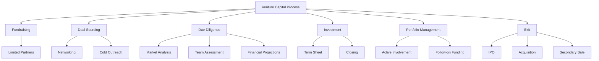

```mermaid
flowchart TD
    A[Venture Capital Process] --> B[Fundraising]
    B --> C[Limited Partners]

    A --> D[Deal Sourcing]
    D --> E[Networking]
    D --> F[Cold Outreach]

    A --> G[Due Diligence]
    G --> H[Market Analysis]
    G --> I[Team Assessment]
    G --> J[Financial Projections]

    A --> K[Investment]
    K --> L[Term Sheet]
    K --> M[Closing]

    A --> N[Portfolio Management]
    N --> O[Active Involvement]
    N --> P[Follow-on Funding]

    A --> Q[Exit]
    Q --> R[IPO]
    Q --> S[Acquisition]
    Q --> T[Secondary Sale]
```
