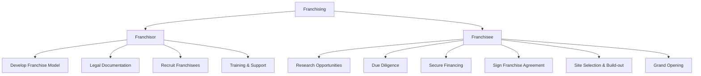

```mermaid
flowchart TD
    A[Franchising] --> B[Franchisor]
    B --> C[Develop Franchise Model]
    B --> D[Legal Documentation]
    B --> E[Recruit Franchisees]
    B --> F[Training & Support]

    A --> G[Franchisee]
    G --> H[Research Opportunities]
    G --> I[Due Diligence]
    G --> J[Secure Financing]
    G --> K[Sign Franchise Agreement]
    G --> L[Site Selection & Build-out]
    G --> M[Grand Opening]
```
