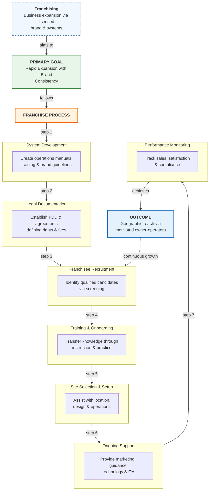

```mermaid
flowchart TD
    A[<b>Franchising</b><br>Business expansion via licensed<br>brand & systems]:::title
    B[<b>PRIMARY GOAL</b><br>Rapid Expansion with Brand<br>Consistency]:::goal
    C[<b>FRANCHISE PROCESS</b>]:::process
    
    subgraph D[System Development]
        D1[Create operations manuals,<br>training & brand guidelines]
    end
    
    subgraph E[Legal Documentation]
        E1[Establish FDD & agreements<br>defining rights & fees]
    end
    
    subgraph F[Franchisee Recruitment]
        F1[Identify qualified candidates<br>via screening]
    end
    
    subgraph G[Training & Onboarding]
        G1[Transfer knowledge through<br>instruction & practice]
    end
    
    subgraph H[Site Selection & Setup]
        H1[Assist with location,<br>design & operations]
    end
    
    subgraph I[Ongoing Support]
        I1[Provide marketing, guidance,<br>technology & QA]
    end
    
    subgraph J[Performance Monitoring]
        J1[Track sales, satisfaction<br>& compliance]
    end
    
    K[<b>OUTCOME</b><br>Geographic reach via<br>motivated owner-operators]:::outcome
    
    A -->|aims to| B
    B -->|follows| C
    C -->|step 1| D
    D -->|step 2| E
    E -->|step 3| F
    F -->|step 4| G
    G -->|step 5| H
    H -->|step 6| I
    I -->|step 7| J
    J -->|achieves| K
    K -.->|continuous growth| F
    
    classDef title fill:#f0f7ff,stroke:#4a6fa5,stroke-width:2px,color:#333,stroke-dasharray:5 5
    classDef goal fill:#e8f5e9,stroke:#2e7d32,stroke-width:2px,color:#333
    classDef process fill:#fff3e0,stroke:#ef6c00,stroke-width:2px,color:#333
    classDef outcome fill:#e3f2fd,stroke:#1565c0,stroke-width:2px,color:#333
```
