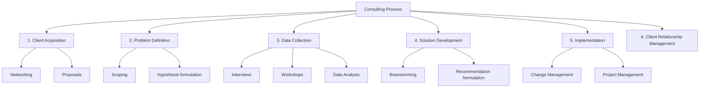

```mermaid
flowchart TD
    A[Consulting Process] --> B[1. Client Acquisition]
    B --> C[Networking]
    B --> D[Proposals]

    A --> E[2. Problem Definition]
    E --> F[Scoping]
    E --> G[Hypothesis formulation]

    A --> H[3. Data Collection]
    H --> I[Interviews]
    H --> J[Workshops]
    H --> K[Data Analysis]

    A --> L[4. Solution Development]
    L --> M[Brainstorming]
    L --> N[Recommendation formulation]

    A --> O[5. Implementation]
    O --> P[Change Management]
    O --> Q[Project Management]

    A --> R[6. Client Relationship Management]
```
