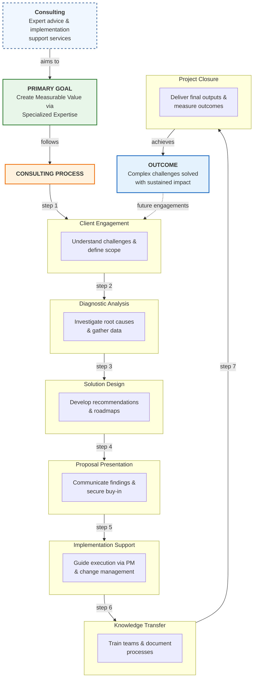

```mermaid
flowchart TD
    A[<b>Consulting</b><br>Expert advice & implementation<br>support services]:::title
    B[<b>PRIMARY GOAL</b><br>Create Measurable Value via<br>Specialized Expertise]:::goal
    C[<b>CONSULTING PROCESS</b>]:::process
    
    subgraph D[Client Engagement]
        D1[Understand challenges &<br>define scope]
    end
    
    subgraph E[Diagnostic Analysis]
        E1[Investigate root causes<br>& gather data]
    end
    
    subgraph F[Solution Design]
        F1[Develop recommendations<br>& roadmaps]
    end
    
    subgraph G[Proposal Presentation]
        G1[Communicate findings &<br>secure buy-in]
    end
    
    subgraph H[Implementation Support]
        H1[Guide execution via PM<br>& change management]
    end
    
    subgraph I[Knowledge Transfer]
        I1[Train teams & document<br>processes]
    end
    
    subgraph J[Project Closure]
        J1[Deliver final outputs &<br>measure outcomes]
    end
    
    K[<b>OUTCOME</b><br>Complex challenges solved<br>with sustained impact]:::outcome
    
    A -->|aims to| B
    B -->|follows| C
    C -->|step 1| D
    D -->|step 2| E
    E -->|step 3| F
    F -->|step 4| G
    G -->|step 5| H
    H -->|step 6| I
    I -->|step 7| J
    J -->|achieves| K
    K -.->|future engagements| D
    
    classDef title fill:#f0f7ff,stroke:#4a6fa5,stroke-width:2px,color:#333,stroke-dasharray:5 5
    classDef goal fill:#e8f5e9,stroke:#2e7d32,stroke-width:2px,color:#333
    classDef process fill:#fff3e0,stroke:#ef6c00,stroke-width:2px,color:#333
    classDef outcome fill:#e3f2fd,stroke:#1565c0,stroke-width:2px,color:#333
```
