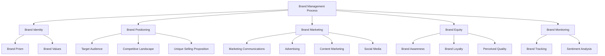

```mermaid
flowchart TD
    A[Brand Management Process] --> B[Brand Identity]
    B --> C[Brand Prism]
    B --> D[Brand Values]

    A --> E[Brand Positioning]
    E --> F[Target Audience]
    E --> G[Competitive Landscape]
    E --> H[Unique Selling Proposition]

    A --> I[Brand Marketing]
    I --> J[Marketing Communications]
    I --> K[Advertising]
    I --> L[Content Marketing]
    I --> M[Social Media]

    A --> N[Brand Equity]
    N --> O[Brand Awareness]
    N --> P[Brand Loyalty]
    N --> Q[Perceived Quality]

    A --> R[Brand Monitoring]
    R --> S[Brand Tracking]
    R --> T[Sentiment Analysis]
```
