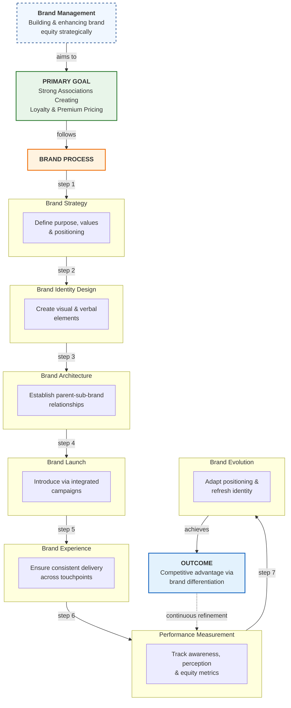

```mermaid
flowchart TD
    A[<b>Brand Management</b><br>Building & enhancing brand<br>equity strategically]:::title
    B[<b>PRIMARY GOAL</b><br>Strong Associations Creating<br>Loyalty & Premium Pricing]:::goal
    C[<b>BRAND PROCESS</b>]:::process
    
    subgraph D[Brand Strategy]
        D1[Define purpose, values<br>& positioning]
    end
    
    subgraph E[Brand Identity Design]
        E1[Create visual & verbal<br>elements]
    end
    
    subgraph F[Brand Architecture]
        F1[Establish parent-sub-brand<br>relationships]
    end
    
    subgraph G[Brand Launch]
        G1[Introduce via integrated<br>campaigns]
    end
    
    subgraph H[Brand Experience]
        H1[Ensure consistent delivery<br>across touchpoints]
    end
    
    subgraph I[Performance Measurement]
        I1[Track awareness, perception<br>& equity metrics]
    end
    
    subgraph J[Brand Evolution]
        J1[Adapt positioning &<br>refresh identity]
    end
    
    K[<b>OUTCOME</b><br>Competitive advantage via<br>brand differentiation]:::outcome
    
    A -->|aims to| B
    B -->|follows| C
    C -->|step 1| D
    D -->|step 2| E
    E -->|step 3| F
    F -->|step 4| G
    G -->|step 5| H
    H -->|step 6| I
    I -->|step 7| J
    J -->|achieves| K
    K -.->|continuous refinement| I
    
    classDef title fill:#f0f7ff,stroke:#4a6fa5,stroke-width:2px,color:#333,stroke-dasharray:5 5
    classDef goal fill:#e8f5e9,stroke:#2e7d32,stroke-width:2px,color:#333
    classDef process fill:#fff3e0,stroke:#ef6c00,stroke-width:2px,color:#333
    classDef outcome fill:#e3f2fd,stroke:#1565c0,stroke-width:2px,color:#333
```
