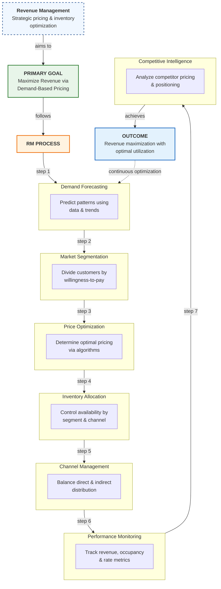

```mermaid
flowchart TD
    A[<b>Revenue Management</b><br>Strategic pricing & inventory<br>optimization]:::title
    B[<b>PRIMARY GOAL</b><br>Maximize Revenue via<br>Demand-Based Pricing]:::goal
    C[<b>RM PROCESS</b>]:::process
    
    subgraph D[Demand Forecasting]
        D1[Predict patterns using<br>data & trends]
    end
    
    subgraph E[Market Segmentation]
        E1[Divide customers by<br>willingness-to-pay]
    end
    
    subgraph F[Price Optimization]
        F1[Determine optimal pricing<br>via algorithms]
    end
    
    subgraph G[Inventory Allocation]
        G1[Control availability by<br>segment & channel]
    end
    
    subgraph H[Channel Management]
        H1[Balance direct & indirect<br>distribution]
    end
    
    subgraph I[Performance Monitoring]
        I1[Track revenue, occupancy<br>& rate metrics]
    end
    
    subgraph J[Competitive Intelligence]
        J1[Analyze competitor pricing<br>& positioning]
    end
    
    K[<b>OUTCOME</b><br>Revenue maximization with<br>optimal utilization]:::outcome
    
    A -->|aims to| B
    B -->|follows| C
    C -->|step 1| D
    D -->|step 2| E
    E -->|step 3| F
    F -->|step 4| G
    G -->|step 5| H
    H -->|step 6| I
    I -->|step 7| J
    J -->|achieves| K
    K -.->|continuous optimization| D
    
    classDef title fill:#f0f7ff,stroke:#4a6fa5,stroke-width:2px,color:#333,stroke-dasharray:5 5
    classDef goal fill:#e8f5e9,stroke:#2e7d32,stroke-width:2px,color:#333
    classDef process fill:#fff3e0,stroke:#ef6c00,stroke-width:2px,color:#333
    classDef outcome fill:#e3f2fd,stroke:#1565c0,stroke-width:2px,color:#333
```