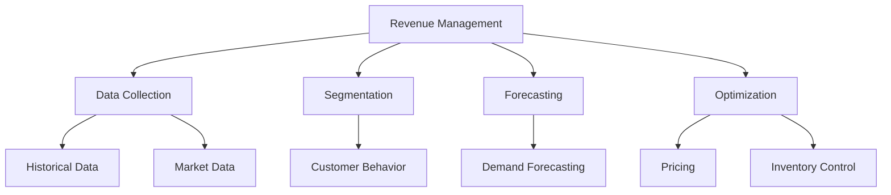

```mermaid
flowchart TD
    RevenueManagement[Revenue Management] --> DataCollection[Data Collection]
    RevenueManagement --> Segmentation[Segmentation]
    RevenueManagement --> Forecasting[Forecasting]
    RevenueManagement --> Optimization[Optimization]
    DataCollection --> Historical[Historical Data]
    DataCollection --> Market[Market Data]
    Segmentation --> CustomerBehavior[Customer Behavior]
    Forecasting --> Demand[Demand Forecasting]
    Optimization --> Pricing[Pricing]
    Optimization --> Inventory[Inventory Control]
```