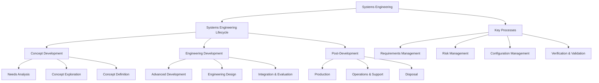

```mermaid
flowchart TD
    SE[Systems Engineering] --> Lifecycle[Systems Engineering Lifecycle]
    SE --> P[Key Processes]

    Lifecycle --> Concept[Concept Development]
    Lifecycle --> Engineering[Engineering Development]
    Lifecycle --> PostDevelopment[Post-Development]

    Concept --> Needs[Needs Analysis]
    Concept --> ConceptExploration[Concept Exploration]
    Concept --> ConceptDefinition[Concept Definition]

    Engineering --> AdvancedDevelopment[Advanced Development]
    Engineering --> EngineeringDesign[Engineering Design]
    Engineering --> IntegrationAndEvaluation[Integration & Evaluation]

    PostDevelopment --> Production[Production]
    PostDevelopment --> OperationsAndSupport[Operations & Support]
    PostDevelopment --> Disposal[Disposal]

    P --> RM[Requirements Management]
    P --> RA[Risk Management]
    P --> CM[Configuration Management]
    P --> VV[Verification & Validation]
```
