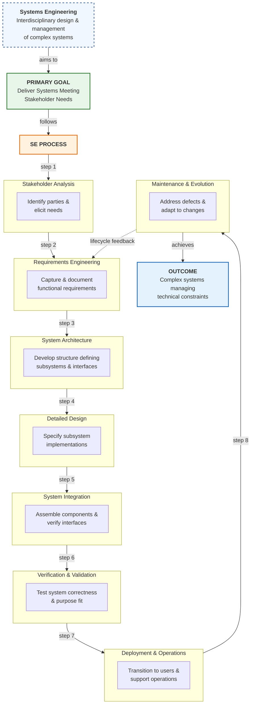

```mermaid
flowchart TD
    A[<b>Systems Engineering</b><br>Interdisciplinary design & management<br>of complex systems]:::title
    B[<b>PRIMARY GOAL</b><br>Deliver Systems Meeting<br>Stakeholder Needs]:::goal
    C[<b>SE PROCESS</b>]:::process
    
    subgraph D[Stakeholder Analysis]
        D1[Identify parties &<br>elicit needs]
    end
    
    subgraph E[Requirements Engineering]
        E1[Capture & document<br>functional requirements]
    end
    
    subgraph F[System Architecture]
        F1[Develop structure defining<br>subsystems & interfaces]
    end
    
    subgraph G[Detailed Design]
        G1[Specify subsystem<br>implementations]
    end
    
    subgraph H[System Integration]
        H1[Assemble components &<br>verify interfaces]
    end
    
    subgraph I[Verification & Validation]
        I1[Test system correctness<br>& purpose fit]
    end
    
    subgraph J[Deployment & Operations]
        J1[Transition to users &<br>support operations]
    end
    
    subgraph K[Maintenance & Evolution]
        K1[Address defects &<br>adapt to changes]
    end
    
    L[<b>OUTCOME</b><br>Complex systems managing<br>technical constraints]:::outcome
    
    A -->|aims to| B
    B -->|follows| C
    C -->|step 1| D
    D -->|step 2| E
    E -->|step 3| F
    F -->|step 4| G
    G -->|step 5| H
    H -->|step 6| I
    I -->|step 7| J
    J -->|step 8| K
    K -->|achieves| L
    K -.->|lifecycle feedback| E
    
    classDef title fill:#f0f7ff,stroke:#4a6fa5,stroke-width:2px,color:#333,stroke-dasharray:5 5
    classDef goal fill:#e8f5e9,stroke:#2e7d32,stroke-width:2px,color:#333
    classDef process fill:#fff3e0,stroke:#ef6c00,stroke-width:2px,color:#333
    classDef outcome fill:#e3f2fd,stroke:#1565c0,stroke-width:2px,color:#333
```
