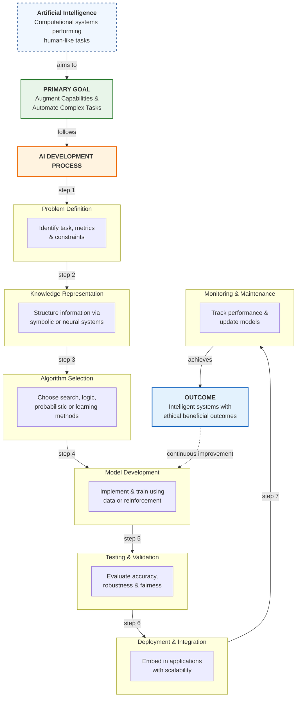

```mermaid
flowchart TD
    A[<b>Artificial Intelligence</b><br>Computational systems performing<br>human-like tasks]:::title
    B[<b>PRIMARY GOAL</b><br>Augment Capabilities &<br>Automate Complex Tasks]:::goal
    C[<b>AI DEVELOPMENT PROCESS</b>]:::process
    
    subgraph D[Problem Definition]
        D1[Identify task, metrics<br>& constraints]
    end
    
    subgraph E[Knowledge Representation]
        E1[Structure information via<br>symbolic or neural systems]
    end
    
    subgraph F[Algorithm Selection]
        F1[Choose search, logic,<br>probabilistic or learning methods]
    end
    
    subgraph G[Model Development]
        G1[Implement & train using<br>data or reinforcement]
    end
    
    subgraph H[Testing & Validation]
        H1[Evaluate accuracy,<br>robustness & fairness]
    end
    
    subgraph I[Deployment & Integration]
        I1[Embed in applications<br>with scalability]
    end
    
    subgraph J[Monitoring & Maintenance]
        J1[Track performance &<br>update models]
    end
    
    K[<b>OUTCOME</b><br>Intelligent systems with<br>ethical beneficial outcomes]:::outcome
    
    A -->|aims to| B
    B -->|follows| C
    C -->|step 1| D
    D -->|step 2| E
    E -->|step 3| F
    F -->|step 4| G
    G -->|step 5| H
    H -->|step 6| I
    I -->|step 7| J
    J -->|achieves| K
    K -.->|continuous improvement| G
    
    classDef title fill:#f0f7ff,stroke:#4a6fa5,stroke-width:2px,color:#333,stroke-dasharray:5 5
    classDef goal fill:#e8f5e9,stroke:#2e7d32,stroke-width:2px,color:#333
    classDef process fill:#fff3e0,stroke:#ef6c00,stroke-width:2px,color:#333
    classDef outcome fill:#e3f2fd,stroke:#1565c0,stroke-width:2px,color:#333
```
