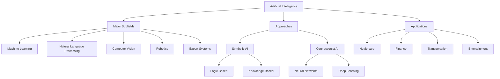

```mermaid
flowchart TD
    AI[Artificial Intelligence] --> Subfields[Major Subfields]
    AI --> Approaches[Approaches]
    AI --> Applications[Applications]

    Subfields --> ML[Machine Learning]
    Subfields --> NLP[Natural Language Processing]
    Subfields --> CV[Computer Vision]
    Subfields --> Robotics[Robotics]
    Subfields --> ES[Expert Systems]

    Approaches --> Symbolic[Symbolic AI]
    Approaches --> Connectionist[Connectionist AI]

    Symbolic --> Logic[Logic-Based]
    Symbolic --> Knowledge[Knowledge-Based]

    Connectionist --> NN[Neural Networks]
    Connectionist --> DL[Deep Learning]

    Applications --> Healthcare[Healthcare]
    Applications --> Finance[Finance]
    Applications --> Transportation[Transportation]
    Applications --> Entertainment[Entertainment]
```
