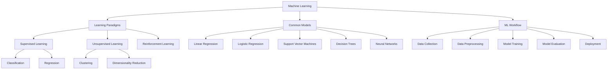

```mermaid
flowchart TD
    ML[Machine Learning] --> Paradigms[Learning Paradigms]
    ML --> Models[Common Models]
    ML --> Workflow[ML Workflow]

    Paradigms --> Supervised[Supervised Learning]
    Paradigms --> Unsupervised[Unsupervised Learning]
    Paradigms --> Reinforcement[Reinforcement Learning]

    Supervised --> Classification[Classification]
    Supervised --> Regression[Regression]

    Unsupervised --> Clustering[Clustering]
    Unsupervised --> DimensionalityReduction[Dimensionality Reduction]

    Models --> Linear[Linear Regression]
    Models --> Logistic[Logistic Regression]
    Models --> SVM[Support Vector Machines]
    Models --> Trees[Decision Trees]
    Models --> NN[Neural Networks]

    Workflow --> DataCollection[Data Collection]
    Workflow --> DataPreprocessing[Data Preprocessing]
    Workflow --> ModelTraining[Model Training]
    Workflow --> ModelEvaluation[Model Evaluation]
    Workflow --> Deployment[Deployment]
```
