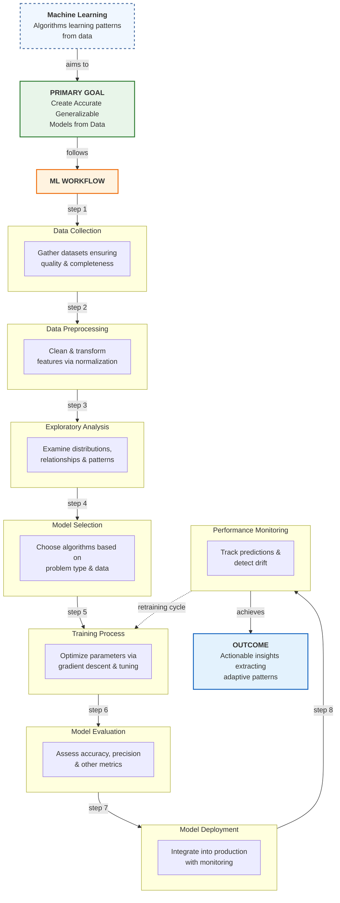

```mermaid
flowchart TD
    A[<b>Machine Learning</b><br>Algorithms learning patterns<br>from data]:::title
    B[<b>PRIMARY GOAL</b><br>Create Accurate Generalizable<br>Models from Data]:::goal
    C[<b>ML WORKFLOW</b>]:::process
    
    subgraph D[Data Collection]
        D1[Gather datasets ensuring<br>quality & completeness]
    end
    
    subgraph E[Data Preprocessing]
        E1[Clean & transform<br>features via normalization]
    end
    
    subgraph F[Exploratory Analysis]
        F1[Examine distributions,<br>relationships & patterns]
    end
    
    subgraph G[Model Selection]
        G1[Choose algorithms based on<br>problem type & data]
    end
    
    subgraph H[Training Process]
        H1[Optimize parameters via<br>gradient descent & tuning]
    end
    
    subgraph I[Model Evaluation]
        I1[Assess accuracy, precision<br>& other metrics]
    end
    
    subgraph J[Model Deployment]
        J1[Integrate into production<br>with monitoring]
    end
    
    subgraph K[Performance Monitoring]
        K1[Track predictions &<br>detect drift]
    end
    
    L[<b>OUTCOME</b><br>Actionable insights extracting<br>adaptive patterns]:::outcome
    
    A -->|aims to| B
    B -->|follows| C
    C -->|step 1| D
    D -->|step 2| E
    E -->|step 3| F
    F -->|step 4| G
    G -->|step 5| H
    H -->|step 6| I
    I -->|step 7| J
    J -->|step 8| K
    K -->|achieves| L
    K -.->|retraining cycle| H
    
    classDef title fill:#f0f7ff,stroke:#4a6fa5,stroke-width:2px,color:#333,stroke-dasharray:5 5
    classDef goal fill:#e8f5e9,stroke:#2e7d32,stroke-width:2px,color:#333
    classDef process fill:#fff3e0,stroke:#ef6c00,stroke-width:2px,color:#333
    classDef outcome fill:#e3f2fd,stroke:#1565c0,stroke-width:2px,color:#333
```
