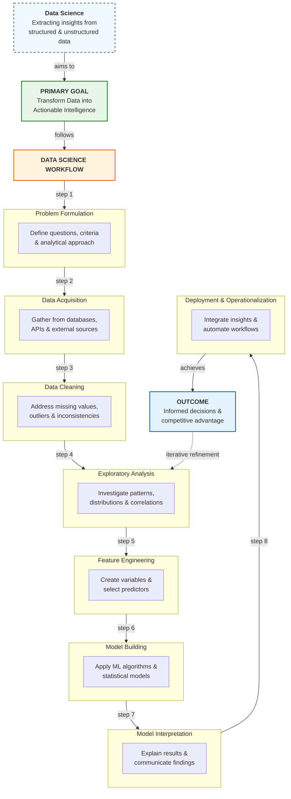

```mermaid
flowchart TD
    A[<b>Data Science</b><br>Extracting insights from<br>structured & unstructured data]:::title
    B[<b>PRIMARY GOAL</b><br>Transform Data into<br>Actionable Intelligence]:::goal
    C[<b>DATA SCIENCE WORKFLOW</b>]:::process
    
    subgraph D[Problem Formulation]
        D1[Define questions, criteria<br>& analytical approach]
    end
    
    subgraph E[Data Acquisition]
        E1[Gather from databases,<br>APIs & external sources]
    end
    
    subgraph F[Data Cleaning]
        F1[Address missing values,<br>outliers & inconsistencies]
    end
    
    subgraph G[Exploratory Analysis]
        G1[Investigate patterns,<br>distributions & correlations]
    end
    
    subgraph H[Feature Engineering]
        H1[Create variables &<br>select predictors]
    end
    
    subgraph I[Model Building]
        I1[Apply ML algorithms &<br>statistical models]
    end
    
    subgraph J[Model Interpretation]
        J1[Explain results &<br>communicate findings]
    end
    
    subgraph K[Deployment & Operationalization]
        K1[Integrate insights &<br>automate workflows]
    end
    
    L[<b>OUTCOME</b><br>Informed decisions &<br>competitive advantage]:::outcome
    
    A -->|aims to| B
    B -->|follows| C
    C -->|step 1| D
    D -->|step 2| E
    E -->|step 3| F
    F -->|step 4| G
    G -->|step 5| H
    H -->|step 6| I
    I -->|step 7| J
    J -->|step 8| K
    K -->|achieves| L
    L -.->|iterative refinement| G
    
    classDef title fill:#f0f7ff,stroke:#4a6fa5,stroke-width:2px,color:#333,stroke-dasharray:5 5
    classDef goal fill:#e8f5e9,stroke:#2e7d32,stroke-width:2px,color:#333
    classDef process fill:#fff3e0,stroke:#ef6c00,stroke-width:2px,color:#333
    classDef outcome fill:#e3f2fd,stroke:#1565c0,stroke-width:2px,color:#333
```
