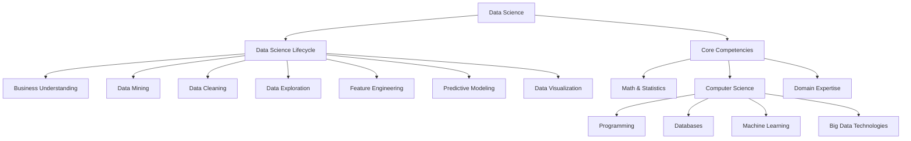

```mermaid
flowchart TD
    DS[Data Science] --> Lifecycle[Data Science Lifecycle]
    DS --> Core[Core Competencies]

    Lifecycle --> BusinessUnderstanding[Business Understanding]
    Lifecycle --> DataMining[Data Mining]
    Lifecycle --> DataCleaning[Data Cleaning]
    Lifecycle --> DataExploration[Data Exploration]
    Lifecycle --> FeatureEngineering[Feature Engineering]
    Lifecycle --> PredictiveModeling[Predictive Modeling]
    Lifecycle --> DataVisualization[Data Visualization]

    Core --> MathStats[Math & Statistics]
    Core --> CS[Computer Science]
    Core --> Domain[Domain Expertise]

    CS --> Programming[Programming]
    CS --> Databases[Databases]
    CS --> ML[Machine Learning]
    CS --> BigData[Big Data Technologies]
```
