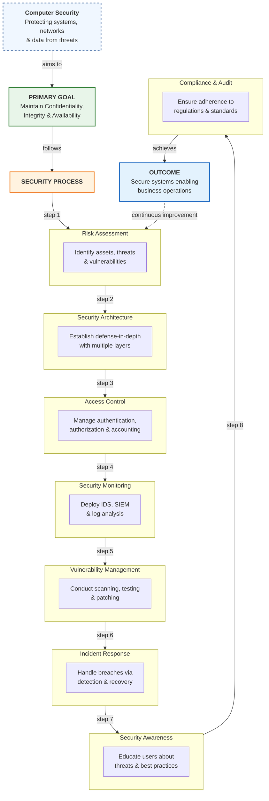

```mermaid
flowchart TD
    A[<b>Computer Security</b><br>Protecting systems, networks<br>& data from threats]:::title
    B[<b>PRIMARY GOAL</b><br>Maintain Confidentiality,<br>Integrity & Availability]:::goal
    C[<b>SECURITY PROCESS</b>]:::process
    
    subgraph D[Risk Assessment]
        D1[Identify assets, threats<br>& vulnerabilities]
    end
    
    subgraph E[Security Architecture]
        E1[Establish defense-in-depth<br>with multiple layers]
    end
    
    subgraph F[Access Control]
        F1[Manage authentication,<br>authorization & accounting]
    end
    
    subgraph G[Security Monitoring]
        G1[Deploy IDS, SIEM<br>& log analysis]
    end
    
    subgraph H[Vulnerability Management]
        H1[Conduct scanning, testing<br>& patching]
    end
    
    subgraph I[Incident Response]
        I1[Handle breaches via<br>detection & recovery]
    end
    
    subgraph J[Security Awareness]
        J1[Educate users about<br>threats & best practices]
    end
    
    subgraph K[Compliance & Audit]
        K1[Ensure adherence to<br>regulations & standards]
    end
    
    L[<b>OUTCOME</b><br>Secure systems enabling<br>business operations]:::outcome
    
    A -->|aims to| B
    B -->|follows| C
    C -->|step 1| D
    D -->|step 2| E
    E -->|step 3| F
    F -->|step 4| G
    G -->|step 5| H
    H -->|step 6| I
    I -->|step 7| J
    J -->|step 8| K
    K -->|achieves| L
    L -.->|continuous improvement| D
    
    classDef title fill:#f0f7ff,stroke:#4a6fa5,stroke-width:2px,color:#333,stroke-dasharray:5 5
    classDef goal fill:#e8f5e9,stroke:#2e7d32,stroke-width:2px,color:#333
    classDef process fill:#fff3e0,stroke:#ef6c00,stroke-width:2px,color:#333
    classDef outcome fill:#e3f2fd,stroke:#1565c0,stroke-width:2px,color:#333
```
