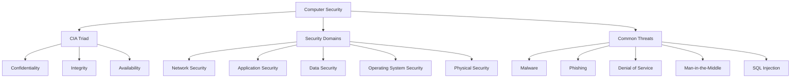

```mermaid
flowchart TD
    CS[Computer Security] --> CIA[CIA Triad]
    CS --> Domains[Security Domains]
    CS --> Threats[Common Threats]

    CIA --> Confidentiality[Confidentiality]
    CIA --> Integrity[Integrity]
    CIA --> Availability[Availability]

    Domains --> Network[Network Security]
    Domains --> Application[Application Security]
    Domains --> Data[Data Security]
    Domains --> OS[Operating System Security]
    Domains --> Physical[Physical Security]

    Threats --> Malware[Malware]
    Threats --> Phishing[Phishing]
    Threats --> DoS[Denial of Service]
    Threats --> MITM[Man-in-the-Middle]
    Threats --> SQLi[SQL Injection]
```
