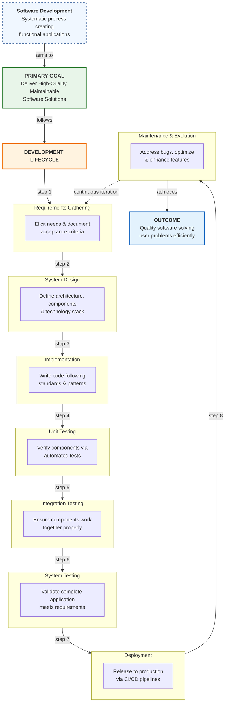

```mermaid
flowchart TD
    A[<b>Software Development</b><br>Systematic process creating<br>functional applications]:::title
    B[<b>PRIMARY GOAL</b><br>Deliver High-Quality Maintainable<br>Software Solutions]:::goal
    C[<b>DEVELOPMENT LIFECYCLE</b>]:::process
    
    subgraph D[Requirements Gathering]
        D1[Elicit needs & document<br>acceptance criteria]
    end
    
    subgraph E[System Design]
        E1[Define architecture, components<br>& technology stack]
    end
    
    subgraph F[Implementation]
        F1[Write code following<br>standards & patterns]
    end
    
    subgraph G[Unit Testing]
        G1[Verify components via<br>automated tests]
    end
    
    subgraph H[Integration Testing]
        H1[Ensure components work<br>together properly]
    end
    
    subgraph I[System Testing]
        I1[Validate complete application<br>meets requirements]
    end
    
    subgraph J[Deployment]
        J1[Release to production<br>via CI/CD pipelines]
    end
    
    subgraph K[Maintenance & Evolution]
        K1[Address bugs, optimize<br>& enhance features]
    end
    
    L[<b>OUTCOME</b><br>Quality software solving<br>user problems efficiently]:::outcome
    
    A -->|aims to| B
    B -->|follows| C
    C -->|step 1| D
    D -->|step 2| E
    E -->|step 3| F
    F -->|step 4| G
    G -->|step 5| H
    H -->|step 6| I
    I -->|step 7| J
    J -->|step 8| K
    K -->|achieves| L
    K -.->|continuous iteration| D
    
    classDef title fill:#f0f7ff,stroke:#4a6fa5,stroke-width:2px,color:#333,stroke-dasharray:5 5
    classDef goal fill:#e8f5e9,stroke:#2e7d32,stroke-width:2px,color:#333
    classDef process fill:#fff3e0,stroke:#ef6c00,stroke-width:2px,color:#333
    classDef outcome fill:#e3f2fd,stroke:#1565c0,stroke-width:2px,color:#333
```
