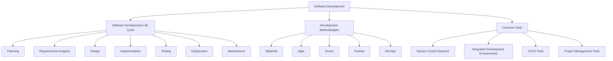

```mermaid
flowchart TD
    SD[Software Development] --> SDLC[Software Development Life Cycle]
    SD --> Methodologies[Development Methodologies]
    SD --> Tools[Common Tools]

    SDLC --> Planning[Planning]
    SDLC --> Requirements[Requirements Analysis]
    SDLC --> Design[Design]
    SDLC --> Implementation[Implementation]
    SDLC --> Testing[Testing]
    SDLC --> Deployment[Deployment]
    SDLC --> Maintenance[Maintenance]

    Methodologies --> Waterfall[Waterfall]
    Methodologies --> Agile[Agile]
    Methodologies --> Scrum[Scrum]
    Methodologies --> Kanban[Kanban]
    Methodologies --> DevOps[DevOps]

    Tools --> VCS[Version Control Systems]
    Tools --> IDEs[Integrated Development Environments]
    Tools --> CI-CD[CI/CD Tools]
    Tools --> PM[Project Management Tools]
```
