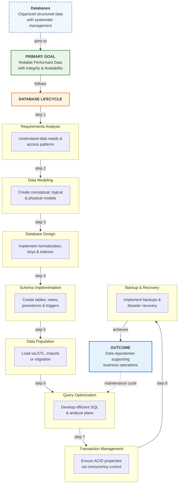

```mermaid
flowchart TD
    A[<b>Databases</b><br>Organized structured data<br>with systematic management]:::title
    B[<b>PRIMARY GOAL</b><br>Reliable Performant Data<br>with Integrity & Availability]:::goal
    C[<b>DATABASE LIFECYCLE</b>]:::process
    
    subgraph D[Requirements Analysis]
        D1[Understand data needs &<br>access patterns]
    end
    
    subgraph E[Data Modeling]
        E1[Create conceptual, logical<br>& physical models]
    end
    
    subgraph F[Database Design]
        F1[Implement normalization,<br>keys & indexes]
    end
    
    subgraph G[Schema Implementation]
        G1[Create tables, views,<br>procedures & triggers]
    end
    
    subgraph H[Data Population]
        H1[Load via ETL, imports<br>or migration]
    end
    
    subgraph I[Query Optimization]
        I1[Develop efficient SQL<br>& analyze plans]
    end
    
    subgraph J[Transaction Management]
        J1[Ensure ACID properties<br>via concurrency control]
    end
    
    subgraph K[Backup & Recovery]
        K1[Implement backups &<br>disaster recovery]
    end
    
    L[<b>OUTCOME</b><br>Data repositories supporting<br>business operations]:::outcome
    
    A -->|aims to| B
    B -->|follows| C
    C -->|step 1| D
    D -->|step 2| E
    E -->|step 3| F
    F -->|step 4| G
    G -->|step 5| H
    H -->|step 6| I
    I -->|step 7| J
    J -->|step 8| K
    K -->|achieves| L
    L -.->|maintenance cycle| I
    
    classDef title fill:#f0f7ff,stroke:#4a6fa5,stroke-width:2px,color:#333,stroke-dasharray:5 5
    classDef goal fill:#e8f5e9,stroke:#2e7d32,stroke-width:2px,color:#333
    classDef process fill:#fff3e0,stroke:#ef6c00,stroke-width:2px,color:#333
    classDef outcome fill:#e3f2fd,stroke:#1565c0,stroke-width:2px,color:#333
```