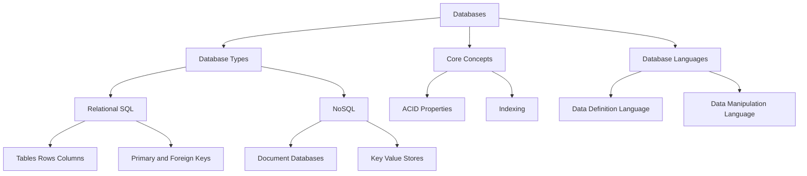

```mermaid
flowchart TD
    Databases[Databases] --> Types[Database Types]
    Databases --> Concepts[Core Concepts]
    Databases --> Languages[Database Languages]
    Types --> Relational[Relational SQL]
    Types --> NoSQL[NoSQL]
    Relational --> Tables[Tables Rows Columns]
    Relational --> Keys[Primary and Foreign Keys]
    NoSQL --> Document[Document Databases]
    NoSQL --> KeyValue[Key Value Stores]
    Concepts --> ACID[ACID Properties]
    Concepts --> Indexing[Indexing]
    Languages --> DDL[Data Definition Language]
    Languages --> DML[Data Manipulation Language]
```