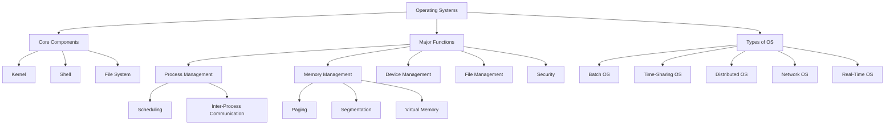

```mermaid
flowchart TD
    OS[Operating Systems] --> Core[Core Components]
    OS --> Functions[Major Functions]
    OS --> Types[Types of OS]

    Core --> Kernel[Kernel]
    Core --> Shell[Shell]
    Core --> FS[File System]

    Functions --> PM[Process Management]
    Functions --> MM[Memory Management]
    Functions --> DM[Device Management]
    Functions --> FM[File Management]
    Functions --> Security[Security]

    PM --> Scheduling[Scheduling]
    PM --> IPC[Inter-Process Communication]

    MM --> Paging[Paging]
    MM --> Segmentation[Segmentation]
    MM --> VM[Virtual Memory]

    Types --> Batch[Batch OS]
    Types --> TimeSharing[Time-Sharing OS]
    Types --> Distributed[Distributed OS]
    Types --> Network[Network OS]
    Types --> RealTime[Real-Time OS]
```
