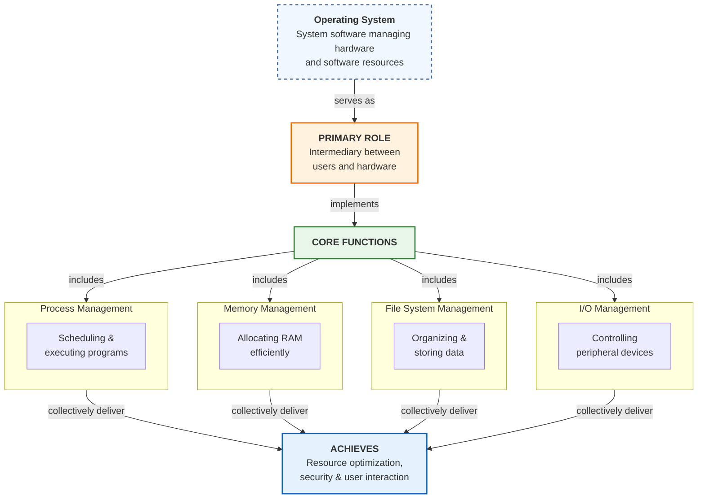

```mermaid
flowchart TD
    A[<b>Operating System</b><br>System software managing hardware<br>and software resources]:::title
    B[<b>PRIMARY ROLE</b><br>Intermediary between<br>users and hardware]:::role
    C[<b>CORE FUNCTIONS</b>]:::functions
    
    subgraph D[Process Management]
        D1[Scheduling &<br>executing programs]
    end
    
    subgraph E[Memory Management]
        E1[Allocating RAM<br>efficiently]
    end
    
    subgraph F[File System Management]
        F1[Organizing &<br>storing data]
    end
    
    subgraph G[I/O Management]
        G1[Controlling<br>peripheral devices]
    end
    
    H[<b>ACHIEVES</b><br>Resource optimization,<br>security & user interaction]:::goal
    
    A -->|serves as| B
    B -->|implements| C
    C -->|includes| D
    C -->|includes| E
    C -->|includes| F
    C -->|includes| G
    D & E & F & G -->|collectively deliver| H
    
    classDef title fill:#f0f7ff,stroke:#4a6fa5,stroke-width:2px,color:#333,stroke-dasharray: 5 5
    classDef role fill:#fff3e0,stroke:#ef6c00,stroke-width:2px,color:#333
    classDef functions fill:#e8f5e9,stroke:#2e7d32,stroke-width:2px,color:#333
    classDef goal fill:#e3f2fd,stroke:#1565c0,stroke-width:2px,color:#333
```
