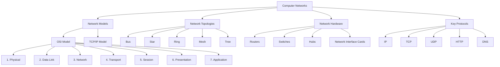

```mermaid
flowchart TD
    CN[Computer Networks] --> Models[Network Models]
    CN --> Topologies[Network Topologies]
    CN --> Hardware[Network Hardware]
    CN --> Protocols[Key Protocols]

    Models --> OSI[OSI Model]
    Models --> TCPIP[TCP/IP Model]

    OSI --> Physical[1. Physical]
    OSI --> DataLink[2. Data Link]
    OSI --> Network[3. Network]
    OSI --> Transport[4. Transport]
    OSI --> Session[5. Session]
    OSI --> Presentation[6. Presentation]
    OSI --> Application[7. Application]

    Topologies --> Bus[Bus]
    Topologies --> Star[Star]
    Topologies --> Ring[Ring]
    Topologies --> Mesh[Mesh]
    Topologies --> Tree[Tree]

    Hardware --> Routers[Routers]
    Hardware --> Switches[Switches]
    Hardware --> Hubs[Hubs]
    Hardware --> NICs[Network Interface Cards]

    Protocols --> IP[IP]
    Protocols --> TCP[TCP]
    Protocols --> UDP[UDP]
    Protocols --> HTTP[HTTP]
    Protocols --> DNS[DNS]
```
