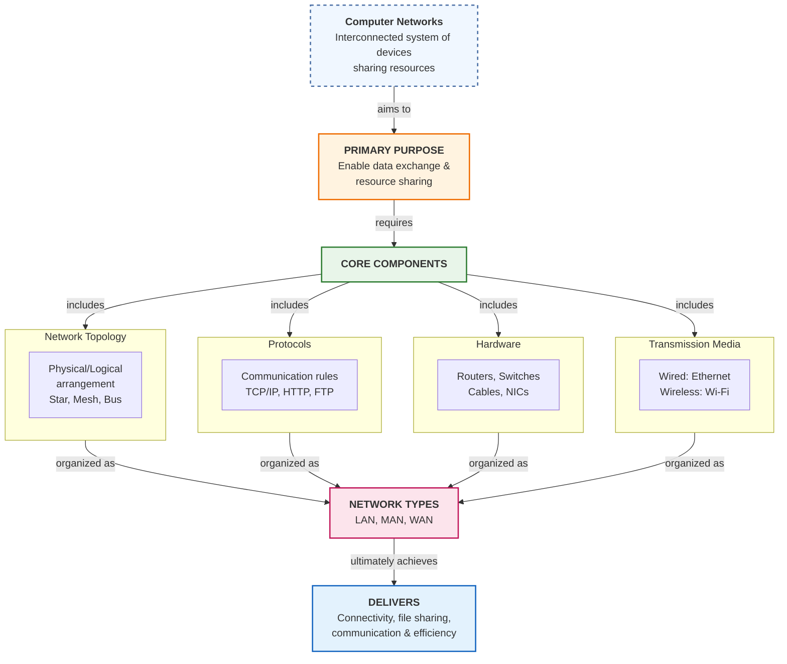

```mermaid
flowchart TD
    A[<b>Computer Networks</b><br>Interconnected system of devices<br>sharing resources]:::title
    B[<b>PRIMARY PURPOSE</b><br>Enable data exchange &<br>resource sharing]:::purpose
    C[<b>CORE COMPONENTS</b>]:::components
    
    subgraph D[Network Topology]
        D1[Physical/Logical<br>arrangement<br>Star, Mesh, Bus]
    end
    
    subgraph E[Protocols]
        E1[Communication rules<br>TCP/IP, HTTP, FTP]
    end
    
    subgraph F[Hardware]
        F1[Routers, Switches<br>Cables, NICs]
    end
    
    subgraph G[Transmission Media]
        G1[Wired: Ethernet<br>Wireless: Wi-Fi]
    end
    
    H[<b>NETWORK TYPES</b><br>LAN, MAN, WAN]:::types
    I[<b>DELIVERS</b><br>Connectivity, file sharing,<br>communication & efficiency]:::goal
    
    A -->|aims to| B
    B -->|requires| C
    C -->|includes| D
    C -->|includes| E
    C -->|includes| F
    C -->|includes| G
    D & E & F & G -->|organized as| H
    H -->|ultimately achieves| I
    
    classDef title fill:#f0f7ff,stroke:#4a6fa5,stroke-width:2px,color:#333,stroke-dasharray: 5 5
    classDef purpose fill:#fff3e0,stroke:#ef6c00,stroke-width:2px,color:#333
    classDef components fill:#e8f5e9,stroke:#2e7d32,stroke-width:2px,color:#333
    classDef types fill:#fce4ec,stroke:#c2185b,stroke-width:2px,color:#333
    classDef goal fill:#e3f2fd,stroke:#1565c0,stroke-width:2px,color:#333
```
