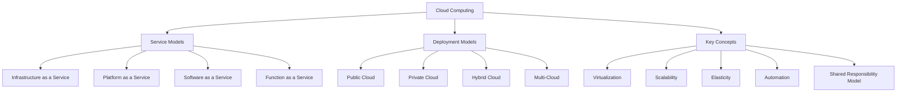

```mermaid
flowchart TD
    CC[Cloud Computing] --> Models[Service Models]
    CC --> Deployments[Deployment Models]
    CC --> Concepts[Key Concepts]

    Models --> IaaS[Infrastructure as a Service]
    Models --> PaaS[Platform as a Service]
    Models --> SaaS[Software as a Service]
    Models --> FaaS[Function as a Service]

    Deployments --> Public[Public Cloud]
    Deployments --> Private[Private Cloud]
    Deployments --> Hybrid[Hybrid Cloud]
    Deployments --> Multi[Multi-Cloud]

    Concepts --> Virtualization[Virtualization]
    Concepts --> Scalability[Scalability]
    Concepts --> Elasticity[Elasticity]
    Concepts --> Automation[Automation]
    Concepts --> Security[Shared Responsibility Model]
```
