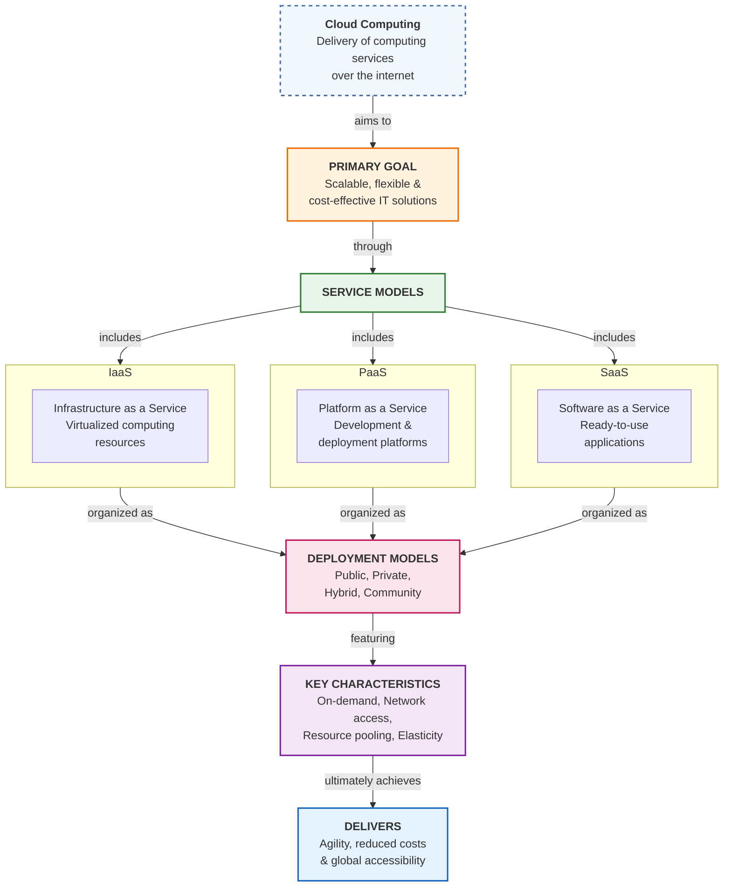

```mermaid
flowchart TD
    A[<b>Cloud Computing</b><br>Delivery of computing services<br>over the internet]:::title
    B[<b>PRIMARY GOAL</b><br>Scalable, flexible &<br>cost-effective IT solutions]:::goal
    C[<b>SERVICE MODELS</b>]:::models
    
    subgraph D[IaaS]
        D1[Infrastructure as a Service<br>Virtualized computing<br>resources]
    end
    
    subgraph E[PaaS]
        E1[Platform as a Service<br>Development &<br>deployment platforms]
    end
    
    subgraph F[SaaS]
        F1[Software as a Service<br>Ready-to-use<br>applications]
    end
    
    G[<b>DEPLOYMENT MODELS</b><br>Public, Private,<br>Hybrid, Community]:::deployment
    
    H[<b>KEY CHARACTERISTICS</b><br>On-demand, Network access,<br>Resource pooling, Elasticity]:::characteristics
    
    I[<b>DELIVERS</b><br>Agility, reduced costs<br>& global accessibility]:::outcome
    
    A -->|aims to| B
    B -->|through| C
    C -->|includes| D
    C -->|includes| E
    C -->|includes| F
    D & E & F -->|organized as| G
    G -->|featuring| H
    H -->|ultimately achieves| I
    
    classDef title fill:#f0f7ff,stroke:#4a6fa5,stroke-width:2px,color:#333,stroke-dasharray: 5 5
    classDef goal fill:#fff3e0,stroke:#ef6c00,stroke-width:2px,color:#333
    classDef models fill:#e8f5e9,stroke:#2e7d32,stroke-width:2px,color:#333
    classDef deployment fill:#fce4ec,stroke:#c2185b,stroke-width:2px,color:#333
    classDef characteristics fill:#f3e5f5,stroke:#7b1fa2,stroke-width:2px,color:#333
    classDef outcome fill:#e3f2fd,stroke:#1565c0,stroke-width:2px,color:#333
```
