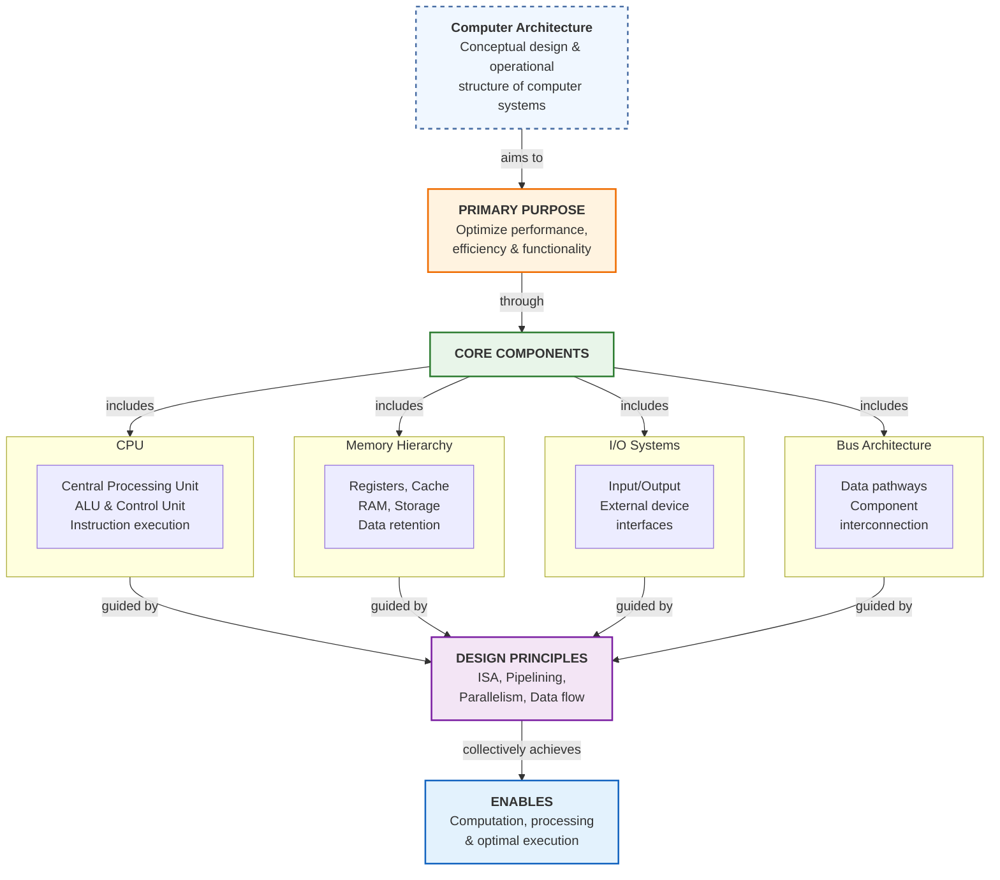

```mermaid
flowchart TD
    A[<b>Computer Architecture</b><br>Conceptual design & operational<br>structure of computer systems]:::title
    B[<b>PRIMARY PURPOSE</b><br>Optimize performance,<br>efficiency & functionality]:::purpose
    C[<b>CORE COMPONENTS</b>]:::components
    
    subgraph D[CPU]
        D1[Central Processing Unit<br>ALU & Control Unit<br>Instruction execution]
    end
    
    subgraph E[Memory Hierarchy]
        E1[Registers, Cache<br>RAM, Storage<br>Data retention]
    end
    
    subgraph F[I/O Systems]
        F1[Input/Output<br>External device<br>interfaces]
    end
    
    subgraph G[Bus Architecture]
        G1[Data pathways<br>Component<br>interconnection]
    end
    
    H[<b>DESIGN PRINCIPLES</b><br>ISA, Pipelining,<br>Parallelism, Data flow]:::principles
    
    I[<b>ENABLES</b><br>Computation, processing<br>& optimal execution]:::outcome
    
    A -->|aims to| B
    B -->|through| C
    C -->|includes| D
    C -->|includes| E
    C -->|includes| F
    C -->|includes| G
    D & E & F & G -->|guided by| H
    H -->|collectively achieves| I
    
    classDef title fill:#f0f7ff,stroke:#4a6fa5,stroke-width:2px,color:#333,stroke-dasharray: 5 5
    classDef purpose fill:#fff3e0,stroke:#ef6c00,stroke-width:2px,color:#333
    classDef components fill:#e8f5e9,stroke:#2e7d32,stroke-width:2px,color:#333
    classDef principles fill:#f3e5f5,stroke:#7b1fa2,stroke-width:2px,color:#333
    classDef outcome fill:#e3f2fd,stroke:#1565c0,stroke-width:2px,color:#333
```
