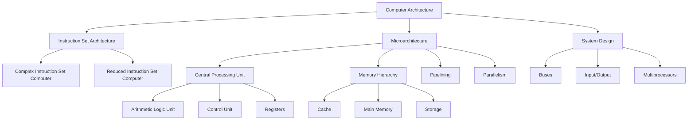

```mermaid
flowchart TD
    CA[Computer Architecture] --> ISA[Instruction Set Architecture]
    CA --> Microarchitecture[Microarchitecture]
    CA --> SystemDesign[System Design]

    ISA --> CISC[Complex Instruction Set Computer]
    ISA --> RISC[Reduced Instruction Set Computer]

    Microarchitecture --> CPU[Central Processing Unit]
    Microarchitecture --> Memory[Memory Hierarchy]
    Microarchitecture --> Pipelining[Pipelining]
    Microarchitecture --> Parallelism[Parallelism]

    CPU --> ALU[Arithmetic Logic Unit]
    CPU --> CU[Control Unit]
    CPU --> Registers[Registers]

    Memory --> Cache[Cache]
    Memory --> RAM[Main Memory]
    Memory --> Storage[Storage]

    SystemDesign --> Buses[Buses]
    SystemDesign --> IO[Input/Output]
    SystemDesign --> Multiprocessors[Multiprocessors]
```
