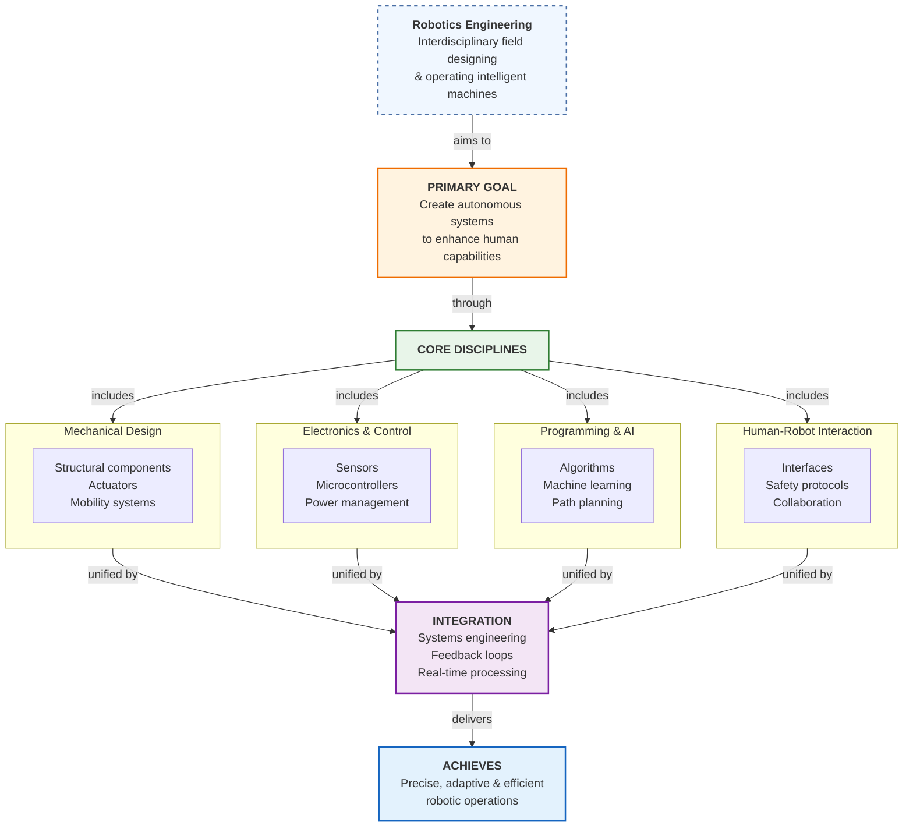

```mermaid
flowchart TD
    A[<b>Robotics Engineering</b><br>Interdisciplinary field designing<br>& operating intelligent machines]:::title
    B[<b>PRIMARY GOAL</b><br>Create autonomous systems<br>to enhance human capabilities]:::goal
    C[<b>CORE DISCIPLINES</b>]:::disciplines
    
    subgraph D[Mechanical Design]
        D1[Structural components<br>Actuators<br>Mobility systems]
    end
    
    subgraph E[Electronics & Control]
        E1[Sensors<br>Microcontrollers<br>Power management]
    end
    
    subgraph F[Programming & AI]
        F1[Algorithms<br>Machine learning<br>Path planning]
    end
    
    subgraph G[Human-Robot Interaction]
        G1[Interfaces<br>Safety protocols<br>Collaboration]
    end
    
    H[<b>INTEGRATION</b><br>Systems engineering<br>Feedback loops<br>Real-time processing]:::integration
    
    I[<b>ACHIEVES</b><br>Precise, adaptive & efficient<br>robotic operations]:::outcome
    
    A -->|aims to| B
    B -->|through| C
    C -->|includes| D
    C -->|includes| E
    C -->|includes| F
    C -->|includes| G
    D & E & F & G -->|unified by| H
    H -->|delivers| I
    
    classDef title fill:#f0f7ff,stroke:#4a6fa5,stroke-width:2px,color:#333,stroke-dasharray: 5 5
    classDef goal fill:#fff3e0,stroke:#ef6c00,stroke-width:2px,color:#333
    classDef disciplines fill:#e8f5e9,stroke:#2e7d32,stroke-width:2px,color:#333
    classDef integration fill:#f3e5f5,stroke:#7b1fa2,stroke-width:2px,color:#333
    classDef outcome fill:#e3f2fd,stroke:#1565c0,stroke-width:2px,color:#333
```