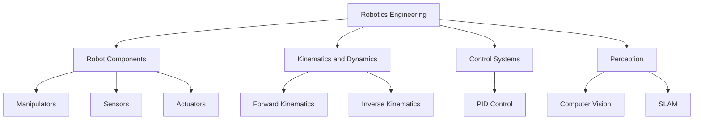

```mermaid
flowchart TD
    RoboticsEngineering[Robotics Engineering] --> Components[Robot Components]
    RoboticsEngineering --> Kinematics[Kinematics and Dynamics]
    RoboticsEngineering --> Control[Control Systems]
    RoboticsEngineering --> Perception[Perception]
    Components --> Manipulators[Manipulators]
    Components --> Sensors[Sensors]
    Components --> Actuators[Actuators]
    Kinematics --> Forward[Forward Kinematics]
    Kinematics --> Inverse[Inverse Kinematics]
    Control --> PID[PID Control]
    Perception --> Vision[Computer Vision]
    Perception --> SLAM[SLAM]
```