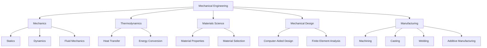

```mermaid
flowchart TD
    ME[Mechanical Engineering] --> Mechanics[Mechanics]
    ME --> Thermo[Thermodynamics]
    ME --> Materials[Materials Science]
    ME --> Design[Mechanical Design]
    ME --> Manufacturing[Manufacturing]

    Mechanics --> Statics[Statics]
    Mechanics --> Dynamics[Dynamics]
    Mechanics --> Fluid[Fluid Mechanics]

    Thermo --> HeatTransfer[Heat Transfer]
    Thermo --> Energy[Energy Conversion]

    Materials --> Properties[Material Properties]
    Materials --> Selection[Material Selection]

    Design --> CAD[Computer-Aided Design]
    Design --> FEA[Finite Element Analysis]

    Manufacturing --> Machining[Machining]
    Manufacturing --> Casting[Casting]
    Manufacturing --> Welding[Welding]
    Manufacturing --> Additive[Additive Manufacturing]
```
