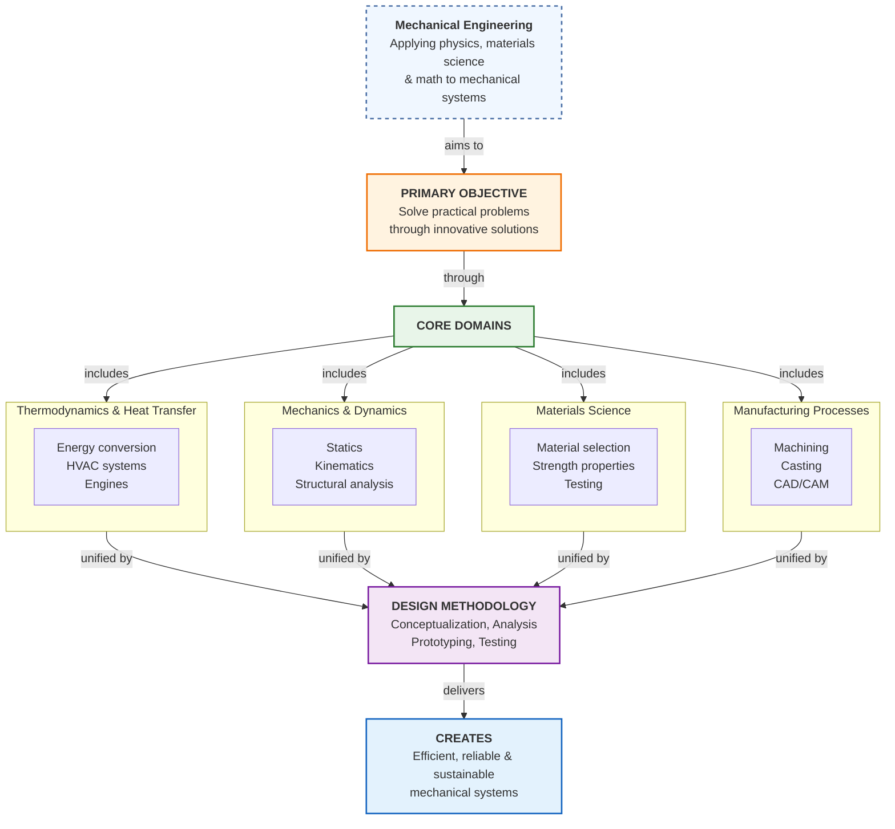

```mermaid
flowchart TD
    A[<b>Mechanical Engineering</b><br>Applying physics, materials science<br>& math to mechanical systems]:::title
    B[<b>PRIMARY OBJECTIVE</b><br>Solve practical problems<br>through innovative solutions]:::objective
    C[<b>CORE DOMAINS</b>]:::domains
    
    subgraph D[Thermodynamics & Heat Transfer]
        D1[Energy conversion<br>HVAC systems<br>Engines]
    end
    
    subgraph E[Mechanics & Dynamics]
        E1[Statics<br>Kinematics<br>Structural analysis]
    end
    
    subgraph F[Materials Science]
        F1[Material selection<br>Strength properties<br>Testing]
    end
    
    subgraph G[Manufacturing Processes]
        G1[Machining<br>Casting<br>CAD/CAM]
    end
    
    H[<b>DESIGN METHODOLOGY</b><br>Conceptualization, Analysis<br>Prototyping, Testing]:::methodology
    
    I[<b>CREATES</b><br>Efficient, reliable & sustainable<br>mechanical systems]:::outcome
    
    A -->|aims to| B
    B -->|through| C
    C -->|includes| D
    C -->|includes| E
    C -->|includes| F
    C -->|includes| G
    D & E & F & G -->|unified by| H
    H -->|delivers| I
    
    classDef title fill:#f0f7ff,stroke:#4a6fa5,stroke-width:2px,color:#333,stroke-dasharray: 5 5
    classDef objective fill:#fff3e0,stroke:#ef6c00,stroke-width:2px,color:#333
    classDef domains fill:#e8f5e9,stroke:#2e7d32,stroke-width:2px,color:#333
    classDef methodology fill:#f3e5f5,stroke:#7b1fa2,stroke-width:2px,color:#333
    classDef outcome fill:#e3f2fd,stroke:#1565c0,stroke-width:2px,color:#333
```
