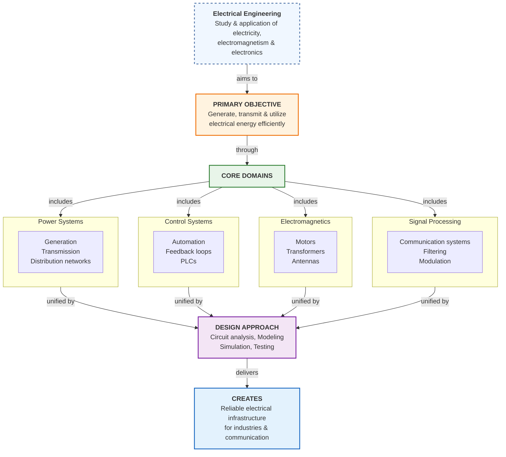

```mermaid
flowchart TD
    A[<b>Electrical Engineering</b><br>Study & application of electricity,<br>electromagnetism & electronics]:::title
    B[<b>PRIMARY OBJECTIVE</b><br>Generate, transmit & utilize<br>electrical energy efficiently]:::objective
    C[<b>CORE DOMAINS</b>]:::domains
    
    subgraph D[Power Systems]
        D1[Generation<br>Transmission<br>Distribution networks]
    end
    
    subgraph E[Control Systems]
        E1[Automation<br>Feedback loops<br>PLCs]
    end
    
    subgraph F[Electromagnetics]
        F1[Motors<br>Transformers<br>Antennas]
    end
    
    subgraph G[Signal Processing]
        G1[Communication systems<br>Filtering<br>Modulation]
    end
    
    H[<b>DESIGN APPROACH</b><br>Circuit analysis, Modeling<br>Simulation, Testing]:::approach
    
    I[<b>CREATES</b><br>Reliable electrical infrastructure<br>for industries & communication]:::outcome
    
    A -->|aims to| B
    B -->|through| C
    C -->|includes| D
    C -->|includes| E
    C -->|includes| F
    C -->|includes| G
    D & E & F & G -->|unified by| H
    H -->|delivers| I
    
    classDef title fill:#f0f7ff,stroke:#4a6fa5,stroke-width:2px,color:#333,stroke-dasharray: 5 5
    classDef objective fill:#fff3e0,stroke:#ef6c00,stroke-width:2px,color:#333
    classDef domains fill:#e8f5e9,stroke:#2e7d32,stroke-width:2px,color:#333
    classDef approach fill:#f3e5f5,stroke:#7b1fa2,stroke-width:2px,color:#333
    classDef outcome fill:#e3f2fd,stroke:#1565c0,stroke-width:2px,color:#333
```
