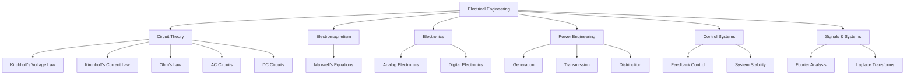

```mermaid
flowchart TD
    EE[Electrical Engineering] --> Circuits[Circuit Theory]
    EE --> EM[Electromagnetism]
    EE --> Electronics[Electronics]
    EE --> Power[Power Engineering]
    EE --> Control[Control Systems]
    EE --> Signals[Signals & Systems]

    Circuits --> KVL[Kirchhoff's Voltage Law]
    Circuits --> KCL[Kirchhoff's Current Law]
    Circuits --> Ohms[Ohm's Law]
    Circuits --> AC[AC Circuits]
    Circuits --> DC[DC Circuits]

    EM --> Maxwells[Maxwell's Equations]

    Electronics --> Analog[Analog Electronics]
    Electronics --> Digital[Digital Electronics]

    Power --> Generation[Generation]
    Power --> Transmission[Transmission]
    Power --> Distribution[Distribution]

    Control --> Feedback[Feedback Control]
    Control --> Stability[System Stability]

    Signals --> Fourier[Fourier Analysis]
    Signals --> Laplace[Laplace Transforms]
```
