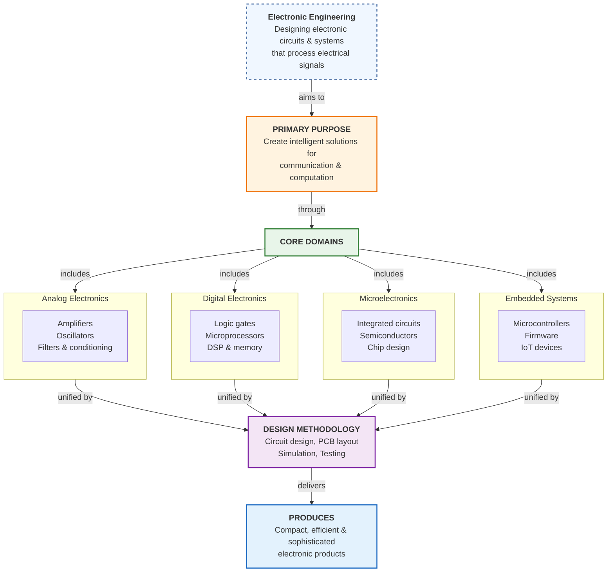

```mermaid
flowchart TD
    A[<b>Electronic Engineering</b><br>Designing electronic circuits & systems<br>that process electrical signals]:::title
    B[<b>PRIMARY PURPOSE</b><br>Create intelligent solutions for<br>communication & computation]:::purpose
    C[<b>CORE DOMAINS</b>]:::domains
    
    subgraph D[Analog Electronics]
        D1[Amplifiers<br>Oscillators<br>Filters & conditioning]
    end
    
    subgraph E[Digital Electronics]
        E1[Logic gates<br>Microprocessors<br>DSP & memory]
    end
    
    subgraph F[Microelectronics]
        F1[Integrated circuits<br>Semiconductors<br>Chip design]
    end
    
    subgraph G[Embedded Systems]
        G1[Microcontrollers<br>Firmware<br>IoT devices]
    end
    
    H[<b>DESIGN METHODOLOGY</b><br>Circuit design, PCB layout<br>Simulation, Testing]:::methodology
    
    I[<b>PRODUCES</b><br>Compact, efficient & sophisticated<br>electronic products]:::outcome
    
    A -->|aims to| B
    B -->|through| C
    C -->|includes| D
    C -->|includes| E
    C -->|includes| F
    C -->|includes| G
    D & E & F & G -->|unified by| H
    H -->|delivers| I
    
    classDef title fill:#f0f7ff,stroke:#4a6fa5,stroke-width:2px,color:#333,stroke-dasharray: 5 5
    classDef purpose fill:#fff3e0,stroke:#ef6c00,stroke-width:2px,color:#333
    classDef domains fill:#e8f5e9,stroke:#2e7d32,stroke-width:2px,color:#333
    classDef methodology fill:#f3e5f5,stroke:#7b1fa2,stroke-width:2px,color:#333
    classDef outcome fill:#e3f2fd,stroke:#1565c0,stroke-width:2px,color:#333
```
