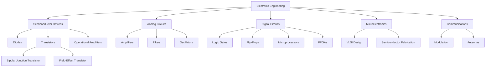

```mermaid
flowchart TD
    ElecE[Electronic Engineering] --> Devices[Semiconductor Devices]
    ElecE --> Analog[Analog Circuits]
    ElecE --> Digital[Digital Circuits]
    ElecE --> Micro[Microelectronics]
    ElecE --> Comm[Communications]

    Devices --> Diodes[Diodes]
    Devices --> Transistors[Transistors]
    Devices --> OpAmps[Operational Amplifiers]

    Transistors --> BJT[Bipolar Junction Transistor]
    Transistors --> FET[Field-Effect Transistor]

    Analog --> Amplifiers[Amplifiers]
    Analog --> Filters[Filters]
    Analog --> Oscillators[Oscillators]

    Digital --> Logic[Logic Gates]
    Digital --> FlipFlops[Flip-Flops]
    Digital --> Microprocessors[Microprocessors]
    Digital --> FPGAs[FPGAs]

    Micro --> VLSI[VLSI Design]
    Micro --> Fabrication[Semiconductor Fabrication]

    Comm --> Modulation[Modulation]
    Comm --> Antennas[Antennas]
```
