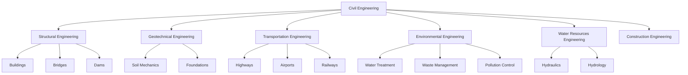

```mermaid
flowchart TD
    CE[Civil Engineering] --> Structural[Structural Engineering]
    CE --> Geotechnical[Geotechnical Engineering]
    CE --> Transportation[Transportation Engineering]
    CE --> Environmental[Environmental Engineering]
    CE --> Water[Water Resources Engineering]
    CE --> Construction[Construction Engineering]

    Structural --> Buildings[Buildings]
    Structural --> Bridges[Bridges]
    Structural --> Dams[Dams]

    Geotechnical --> Soil[Soil Mechanics]
    Geotechnical --> Foundations[Foundations]

    Transportation --> Highways[Highways]
    Transportation --> Airports[Airports]
    Transportation --> Railways[Railways]

    Environmental --> WaterTreatment[Water Treatment]
    Environmental --> WasteManagement[Waste Management]
    Environmental --> Pollution[Pollution Control]

    Water --> Hydraulics[Hydraulics]
    Water --> Hydrology[Hydrology]
```
