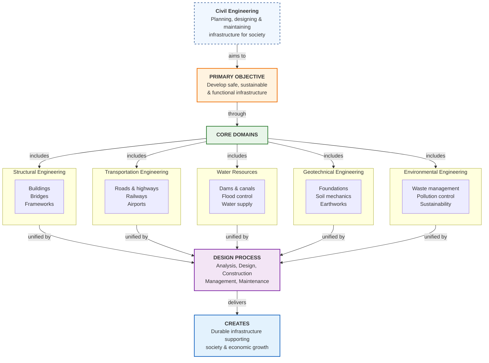

```mermaid
flowchart TD
    A[<b>Civil Engineering</b><br>Planning, designing & maintaining<br>infrastructure for society]:::title
    B[<b>PRIMARY OBJECTIVE</b><br>Develop safe, sustainable<br>& functional infrastructure]:::objective
    C[<b>CORE DOMAINS</b>]:::domains
    
    subgraph D[Structural Engineering]
        D1[Buildings<br>Bridges<br>Frameworks]
    end
    
    subgraph E[Transportation Engineering]
        E1[Roads & highways<br>Railways<br>Airports]
    end
    
    subgraph F[Water Resources]
        F1[Dams & canals<br>Flood control<br>Water supply]
    end
    
    subgraph G[Geotechnical Engineering]
        G1[Foundations<br>Soil mechanics<br>Earthworks]
    end
    
    subgraph H[Environmental Engineering]
        H1[Waste management<br>Pollution control<br>Sustainability]
    end
    
    I[<b>DESIGN PROCESS</b><br>Analysis, Design, Construction<br>Management, Maintenance]:::process
    
    J[<b>CREATES</b><br>Durable infrastructure supporting<br>society & economic growth]:::outcome
    
    A -->|aims to| B
    B -->|through| C
    C -->|includes| D
    C -->|includes| E
    C -->|includes| F
    C -->|includes| G
    C -->|includes| H
    D & E & F & G & H -->|unified by| I
    I -->|delivers| J
    
    classDef title fill:#f0f7ff,stroke:#4a6fa5,stroke-width:2px,color:#333,stroke-dasharray: 5 5
    classDef objective fill:#fff3e0,stroke:#ef6c00,stroke-width:2px,color:#333
    classDef domains fill:#e8f5e9,stroke:#2e7d32,stroke-width:2px,color:#333
    classDef process fill:#f3e5f5,stroke:#7b1fa2,stroke-width:2px,color:#333
    classDef outcome fill:#e3f2fd,stroke:#1565c0,stroke-width:2px,color:#333
```
