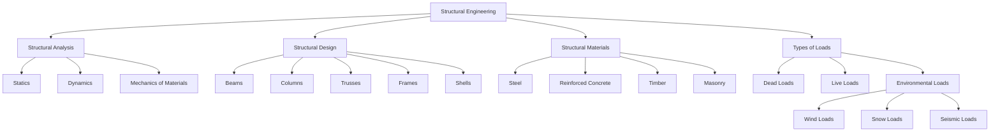

```mermaid
flowchart TD
    SE[Structural Engineering] --> Analysis[Structural Analysis]
    SE --> Design[Structural Design]
    SE --> Materials[Structural Materials]
    SE --> Loads[Types of Loads]

    Analysis --> Statics[Statics]
    Analysis --> Dynamics[Dynamics]
    Analysis --> Mechanics[Mechanics of Materials]

    Design --> Beams[Beams]
    Design --> Columns[Columns]
    Design --> Trusses[Trusses]
    Design --> Frames[Frames]
    Design --> Shells[Shells]

    Materials --> Steel[Steel]
    Materials --> Concrete[Reinforced Concrete]
    Materials --> Timber[Timber]
    Materials --> Masonry[Masonry]

    Loads --> Dead[Dead Loads]
    Loads --> Live[Live Loads]
    Loads --> Environmental[Environmental Loads]

    Environmental --> Wind[Wind Loads]
    Environmental --> Snow[Snow Loads]
    Environmental --> Seismic[Seismic Loads]
```
